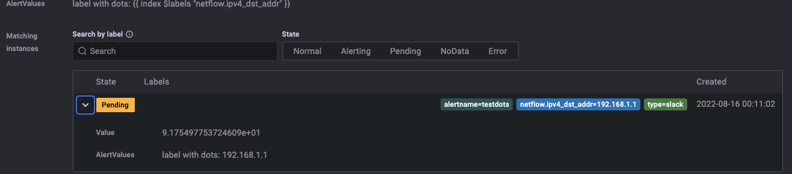

# Grafana-provisioning

Setting the paths.provisioning property in the main config file:
```
[paths]
provisioning = <path to config files>
```
The provisioning directory assumes the following structure:
```
provisioning/
├── alerting
├── dashboards
├── datasources
├── notifiers
└── plugins

```
>Note: The provisioning directory contains configuration files that are applied whenever Grafana starts and continuously updated while running.

# Delete database/rules provisioning

1. Remove the reference to the dashboard in `provisioning.yaml`

2. Delete the dashboard JSON file (not sure if this step is required but I had already deleted mine by this stage)

3. Connect to the sqlite database: `sqlite3 /var/lib/grafana/grafana.db`

4. Find the id of your provisioned dashboard: `select id, name from dashboard_provisioning;`

5. Delete the entry:` delete from dashboard_provisioning where id = 6;` Use step 4 again to check everything went as planned.

6. Quit sqlite: `.quit`

7. Go back into the web UI and you will now be able to delete the provisioned dashboard.

sqlite3-command:
```
sqlite3 /var/lib/grafana/grafana.db
.open /var/lib/grafana/grafana.db
.table
.schema alert_rule
select id, title, condition from alert_rule;
delete from alert_rule where id = 6;
```

# Export an alert rule in provisioning file format

```
GET	/api/v1/provisioning/alert-rules/{UID}/export
```
> example: `https://local-grafana.com/api/v1/provisioning/alert-rules/fe975fb0-6bd0-4442-9cdb-0f04e09d4e99/export`

> v9.2.5  `GET	/api/v1/provisioning/alert-rules/{UID}/export`

# Templating labels and annotations

- If lables is in Alert:
```
{{ index $values.B0.Labels "netflow.ipv4_dst_addr" }}
```

- If the $labels variable contains the labels from the query.
```
{{ $lables.names }}
```

- more: https://grafana.com/docs/grafana/latest/alerting/fundamentals/annotation-label/variables-label-annotation/